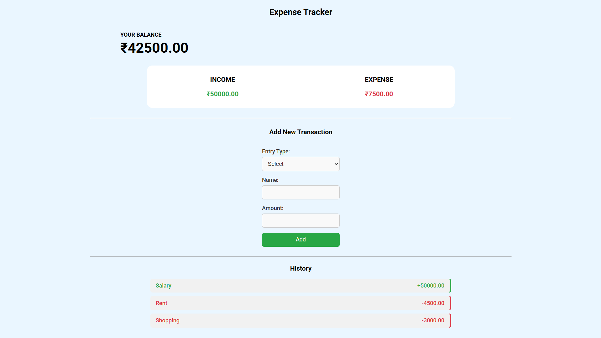

# Expense Tracker

A simple and responsive web-based Expense Tracker to manage your personal income and expenses with real-time balance updates and persistent local storage.

## 🌐 Live Demo

**[View Live App](https://expense-tracker-qb4y.onrender.com/)**

## 📸 Preview



## 🚀 Features

- Add income or expense transactions
- Auto-calculates:
  - 💵 Total Income
  - 💸 Total Expenses
  - 💰 Current Balance
- Transaction history with styling based on type
- Persists data using `localStorage`
- Simple, intuitive user interface
- Fully responsive design

## 🛠️ Technologies Used

- HTML5
- CSS3
- JavaScript (Vanilla)

## 📂 Project Structure

```plaintext
Expense-Tracker/
│
├── assets/
│   └── preview.png
├── index.html
├── README.md
├── script.js
└── style.css
```

## 📋 How to Use

### Option 1: Use the Live App
Visit **[https://expense-tracker-qb4y.onrender.com/](https://expense-tracker-qb4y.onrender.com/)** to start tracking your expenses immediately!

### Option 2: Run Locally

1. **Clone the Repository**
   ```bash
   git clone https://github.com/PrasadNayak01/Expense-Tracker.git
   cd Expense-Tracker
   ```

2. **Open the App**
   - Double-click `index.html`, or
   - Open it via Live Server in VS Code

3. **Start Tracking**
   - Select entry type (income or expense)
   - Enter a name and amount
   - Click **Add**
   - Your transaction will be saved and displayed in the history

## 🧠 How It Works

- App listens for form submit events
- Validates and stores transactions in an array
- Calculates and displays totals dynamically
- Stores transaction data in `localStorage` to persist across sessions
- Uses fallback for environments where localStorage isn't available

## 🧼 Resetting Data

To clear saved transactions:
- Open Developer Tools → Application → Local Storage
- Clear the data for the site

## 🚀 Deployment

This app is deployed on [Render](https://render.com/) as a static site.
---

Made by [Prasad Nayak](https://github.com/PrasadNayak01)
